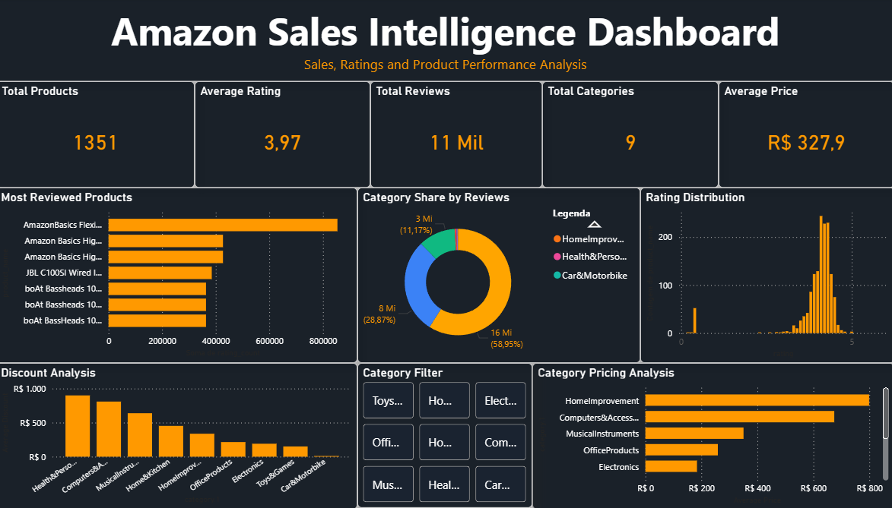

# Amazon Sales Dashboard

Projeto de análise de dados desenvolvido com foco em Business Intelligence e visualização de dados utilizando Power BI, SQL e Power Query.

## Objetivo
O projeto tem como objetivo realizar o tratamento, modelagem e análise de dados de vendas da Amazon, gerando dashboards e indicadores para apoio à tomada de decisão.

## Ferramentas utilizadas
- Power BI
- SQL
- Power Query
- Excel
- Git/GitHub

## Principais análises
- Faturamento total
- Quantidade de vendas
- Produtos mais vendidos
- Avaliações de clientes
- Distribuição por categorias
- KPIs de desempenho

## Etapas do projeto
-  Coleta dos dados
-  Limpeza e tratamento inicial
-  Modelagem dos dados
-  Criação de dashboards
-  KPIs e métricas
-  Automatizações e melhorias

## Aprendizados
Durante o desenvolvimento deste projeto, foram aplicados conceitos de:
- Tratamento e limpeza de dados
- Modelagem relacional
- Criação de dashboards
- SQL para análise de dados
- Power Query
- Business Intelligence

## Autor
Felipe Honório

LinkedIn: https://linkedin.com/in/felipehonorio00
